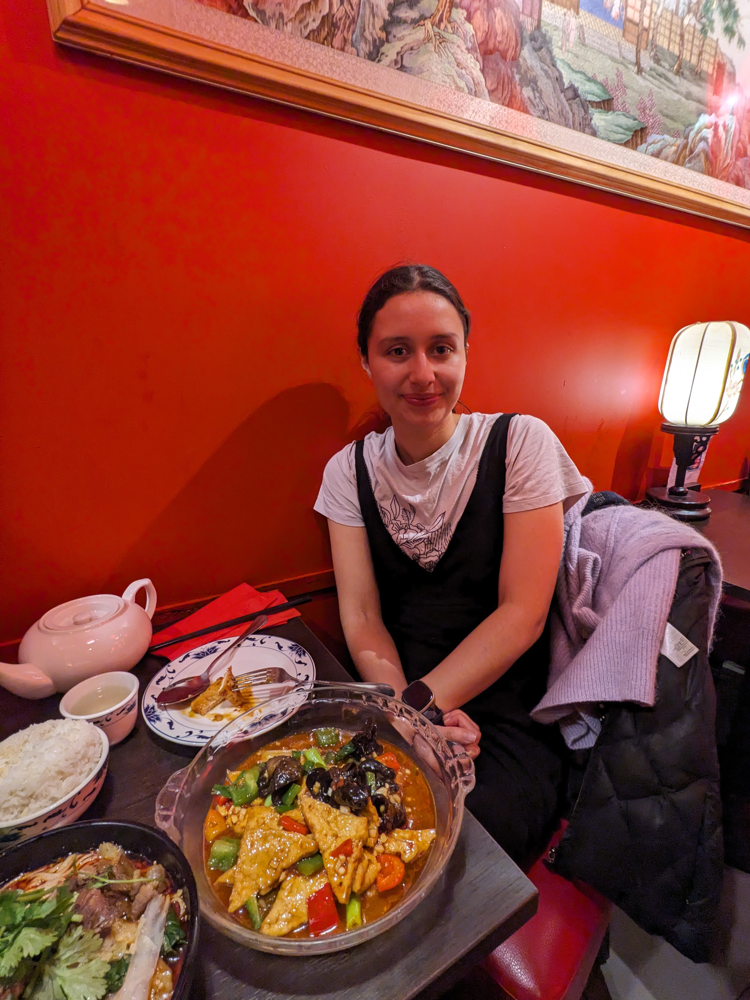
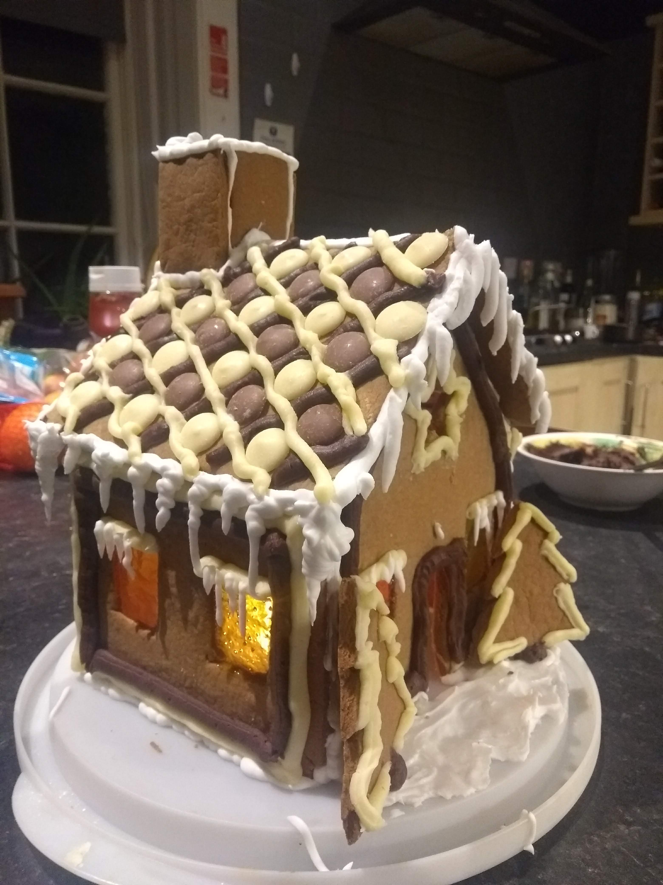
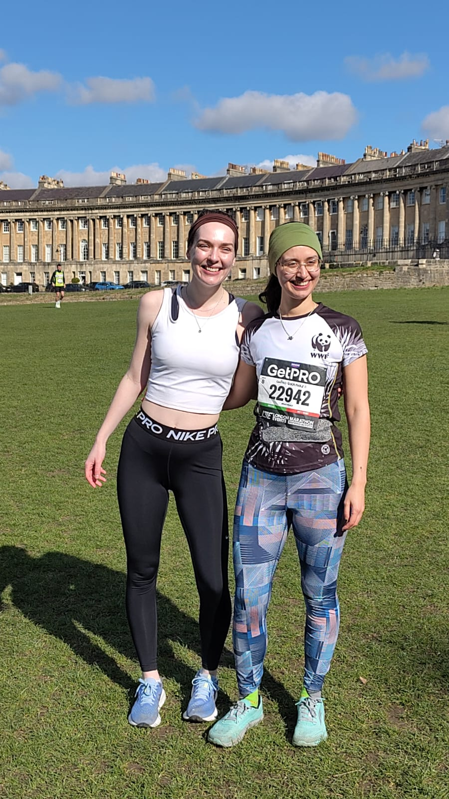
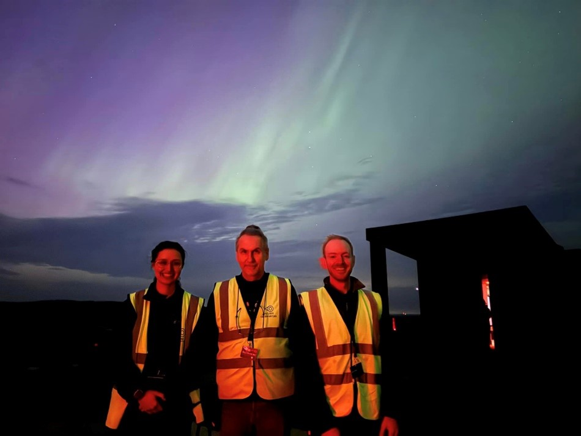
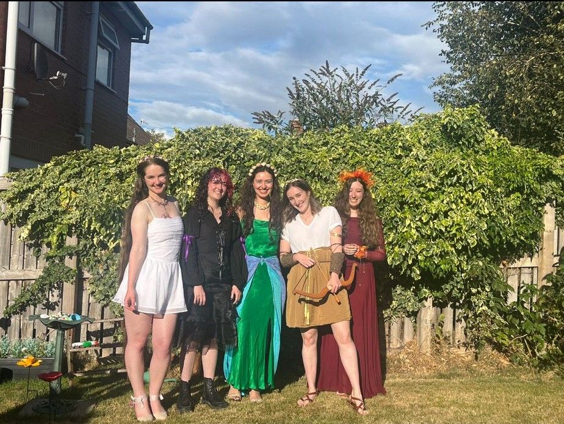

<link href="css/gallery.css" rel="stylesheet" type="text/css">

<!--######### About me section ###########-->
  <!-- 

    <section class="section home" id="home">
      

        
 Home 

        
 -->

    <section class="section about" id="about">
      

        
About

        
        

          My name's Rosie and I built this to help me learn HTML, plus to display some of my
    achievements and work experience. I am an astronomer, graduated with an MSc in astrophysics from the University of St Andrews in 2021. Currently I am working as a science communicator at Kielder Observatory in Northumberland. Please explore my page. If you want to know what I look like here is an idyllic photo of me in Crete in 2021... however this is not a good representation of what I look like in my daily life.
          

  

    </section>

<!-- ##################### Photo Gallery ################## -->

    

      

        <h2>Photo gallery</h2>
        

        Pictures speak a thousand words, and I can't be bothered to write any more code. So here are some images from my life, they mostly contain food, family, friends, general outdoorsy-ness, and maybe some baking (bake-off 2026 here I come!)  

      

    

 
  

  

  <!-- Slideshow container -->
  

    <!-- Full-width images with number and caption text -->
    

      
1 / 13

      
      
 Having a succulent Chinese meal. 

    

    
   

      
2 / 13

      
      
Graduation day! Our teachers rightfully knelt beneath us.

    

   

      
3 / 13

      
      
My Family

    

   

      
4 / 13

      
      
May Dip! Moments before descending into the North Sea at 5am. St Andrews has weird traditions...

    

    

  

      
5 / 13

      
      
North Pennines

    

   

      
6 / 13

      
      
Somewhere in the Alps I believe

    

   

      
7 / 13

      
      
Lockdown gingerbread house

    

  

      
8 / 13

      
      
 Bath Half Marathon 2025 

    

   

      
9 / 13

      
      
May 2024 Mega Aurora!

    

   

      
10 / 13

      
      
 Lake District

    

  

      
11 / 13

      
      
 Summer Greek Party!

    

   

      
12 / 13

      
      
 Hillwalking in North Uist

    
   

   

      
13 / 13

      
      
On the Sun

    

   <!-- Next and previous buttons -->
   <a class="prev" onclick="plusSlides(-1)">&#10094;</a>
    <a class="next" onclick="plusSlides(1)">&#10095;</a>
     

   <!-- The dots/circles -->
   

    
    
    
    
    
    
    
    
    
    
    
    
    
    

  

  <!-- </section-gallery> -->

 

<!-- ########################################

  
  

    
    
A cheerful day.

  

  

    
    
Lockdown gingerbread house. 

  
 -->

