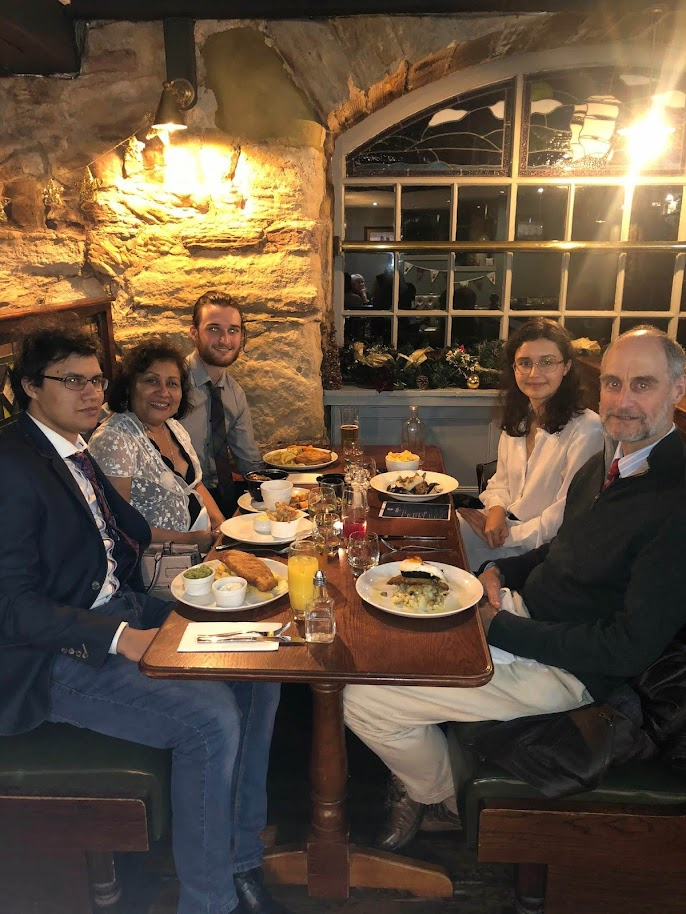
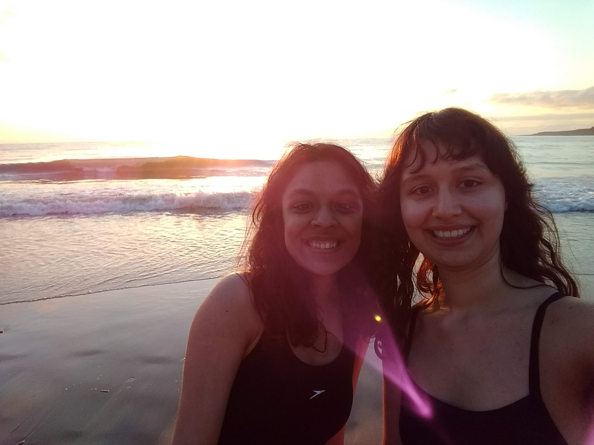

<link href="css/gallery.css" rel="stylesheet" type="text/css">

<!--######### About me section ###########-->
  <!-- 

    <section class="section home" id="home">
      

        
 Home 

        
 -->

    <section class="section about" id="about">
      

        
About

        
        

          My name's Rosie and I built this website to help me learn HTML, plus to display some of my achievements and work experience. I am an astronomer, graduated from the University of St Andrews in 2021. Recently I completed an internship in Data Science, and have experience with Python, MATLAB, Java, Linux, Windows and more! Currently I spend my time learning about astronomy and writing a blog. Please explore my page, I'm hoping to add more on to the web site soon. If you want to know what I look like here is an idyllic photo of me in Crete in 2021... however this is not a good representation of what I look like in my daily life.
          

  

    </section>

<!-- ##################### Photo Gallery ################## -->

    

      

        <h2>Photo gallery</h2>
        

        Pictures speak a thousand words, and I can't be bothered to write any more code. So here are some images from my life, they mostly contain family, friends, general outdoorsy-ness, and maybe some baking (bake-off 2023 here I come!)  

      

    

 
  

  

  <!-- Slideshow container -->
  

    <!-- Full-width images with number and caption text -->
    

      
1 / 7

      
      
On the pier in St Andrews

    

    
   

      
2 / 7

      
      
Graduation day! Our teachers rightfully knelt beneath us.

    

   

      
3 / 7

      
      
My Family

    

   

      
4 / 7

      
      
May Dip! Moments before descending into the North Sea at 5am. St Andrews has weird traditions...

    

    
   

      
5 / 7

      
      
 Hillwalking

    

   

      
6 / 7

      
      
Somewhere in the Alps I believe

    

   

      
7 / 7

      
      
Lockdown gingerbread house

    

   <!-- Next and previous buttons -->
   <a class="prev" onclick="plusSlides(-1)">&#10094;</a>
    <a class="next" onclick="plusSlides(1)">&#10095;</a>
     

   <!-- The dots/circles -->
   

    
    
    
    
    
    
    
    

  

  <!-- </section-gallery> -->

 

<!-- ########################################

  
  

    
    
A cheerful day.

  

  

    
    
Lockdown gingerbread house. 

  
 -->

