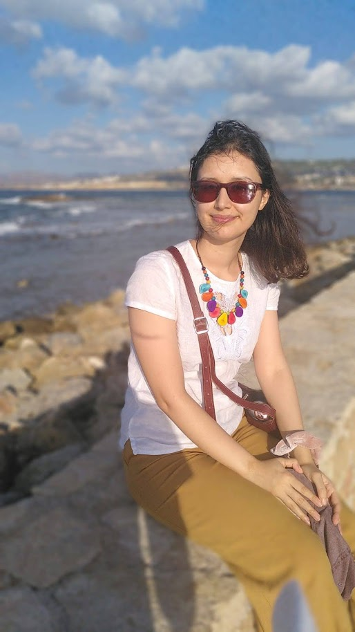

  

    <section class="section home" id="home">
      

        
 Home 

        
        

      Hello and welcome to the home page of my website! My name's Rosie and I built this website to help me learn HTML, plus to display some of my
    achievements and work experience. I graduated with an MSc in astrophysics from the University of St Andrews in 2021. Currently I am working as a science communicator at Kielder Observatory in Northumberland. Feel free to explore my portfolio of projects and work experience. Or check out my blog where I write about all things astronomy related. If you want to know what I look like here is an idyllic photo of me in Crete in 2021... however this is not a good representation of what I look like in my daily life.

  </section>
 
